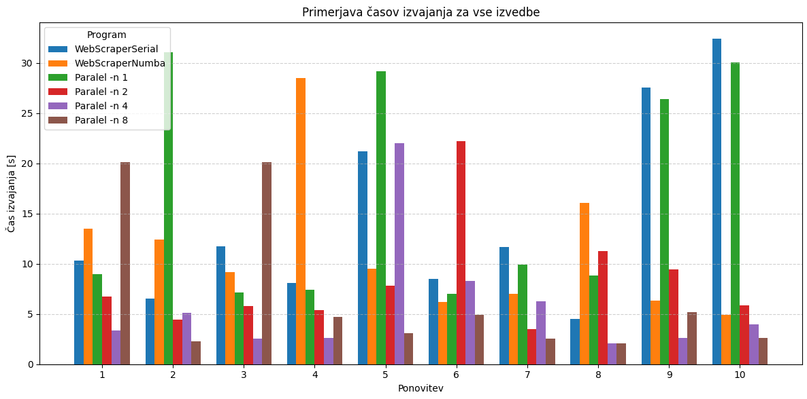
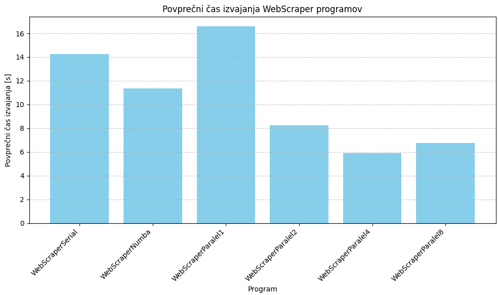
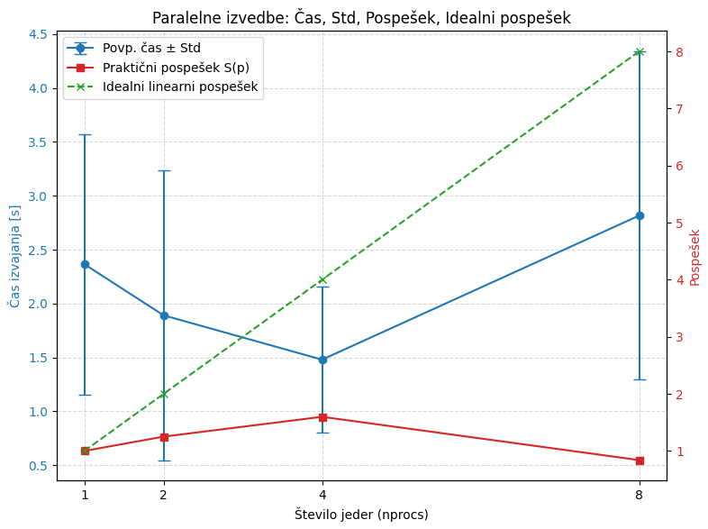
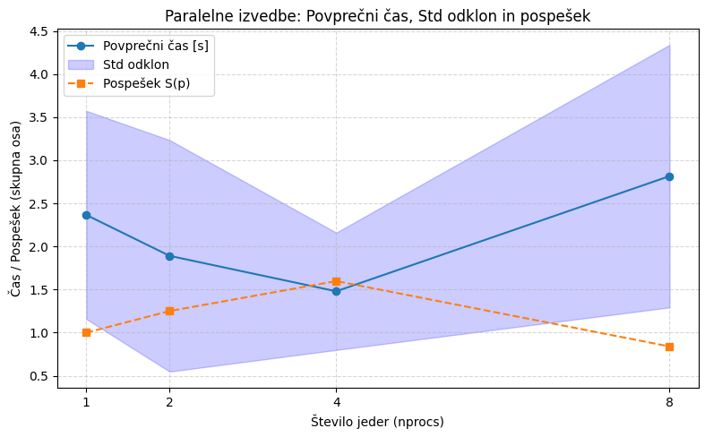

# WebScraper Projekt

Cilj projekta je preučiti učinkovitost različnih izvedb spletnega pajka, ki išče določeno ključna besedo na seznamu URL-jev. Problem spletnega pajkanja je v tem, da je aplikacija **delno CPU-bound** (obdelava vsebine strani, iskanje ključnih besed) in **delno I/O-bound** (čakanje na odzive strežnikov). To pomeni, da preprosta serijska izvedba pogosto ni optimalna, še posebej pri večjem številu URL-jev. Hkrati je pri paralelizaciji potrebno upoštevati tudi **omrežni overhead, komunikacijo med procesi in neenakomerno porazdelitev dela**.

Projekt vključuje tri implementacije spletnega pajka:

* **WebScraperSerial.py** – serijska izvedba (1 proces)
* **WebScraperParalel.py** – MPI izvedba z `mpi4py`, ki omogoča razdelitev dela med več procesov
* **WebSerialNumba.py** – serijska izvedba z Numba JIT optimizacijo, ki pospeši CPU-bound dele programa
* **urls.txt** – seznam URL-jev, na katerih se izvaja iskanje ključne besede (privzeta je `fakulteta`)

---

## Zagon programov

**Serijska verzija:**

```bash
python WebScraperSerial.py urls.txt fakulteta
```

**MPI verzija (z različnim številom jeder):**

```bash
mpiexec -n 4 python WebScraperParalel.py urls.txt fakulteta
```

**Numba serijska verzija:**

```bash
python WebSerialNumba.py urls.txt fakulteta
```

---

## Zahteve

Za vsako implementacijo je potrebno:

* Izvesti vsaj 10 ponovitev za zanesljivost meritev
* Izračunati povprečni čas, standardni odklon, minimalni in maksimalni čas
* Za MPI izvedbe preizkusiti različna števila procesov (1, 2, 4, 8)

S tem pristopom lahko ocenimo **pospešek** posamezne izvedbe in vpliv paralelizacije, pri čemer se upošteva tudi Karp-Flattova metrika za analizo učinkovitosti MPI.

---

## Delovanje programov


### Serijska izvedba

Serijska verzija programa zaporedno obdela naključno izbranih 20 URL-naslovov iz datoteke `urls.txt`. Za vsak URL se izvede HTTP-zahteva z uporabo knjižnice `requests`. Če je stran uspešno dosegljiva, program preveri, ali se podana ključna beseda nahaja v vsebini strani.

Merjenje časa se izvede 10-krat. Pri vsakem zagonu se izbere nov naključni vzorec dvajsetih URL-jev. Na koncu program izpiše povprečni čas izvajanja, standardni odklon ter minimalni in maksimalni čas.

Ta izvedba predstavlja osnovno referenco za primerjavo z ostalimi pristopi.

### Paralelna izvedba z MPI

Paralelna verzija uporablja knjižnico `mpi4py`, ki omogoča izvajanje programa na več procesih. Program se zažene z ukazom `mpiexec -n N`, kjer `N` določa število procesov oziroma jeder.

Proces z rangom 0 (master) prebere seznam URL-naslovov iz datoteke in ga nato pošlje vsem ostalim procesom z metodo `bcast`. Pri vsakem izmed 10 meritev se naključno izbere 20 URL-jev, nato se ti razdelijo med procese. Vsak proces obdela svoj del URL-naslovov in preveri prisotnost ključne besede.

Čas izvajanja se meri od začetka do konca obdelave, pri čemer se uporabi največji čas med vsemi procesi, saj skupni čas paralelnega programa določa najpočasnejši proces. Na koncu proces 0 izpiše statistiko časov izvajanja.

Ta pristop omogoča primerjavo hitrosti pri različnem številu procesov, na primer pri `-n 1`, `-n 2`, `-n 4` in `-n 8`.

### Serijska izvedba z Numba

Tretja izvedba je prav tako serijska, vendar za iskanje ključne besede uporablja knjižnico Numba. Funkcija `contains_keyword` je označena z dekoratorjem `@njit`, kar pomeni, da jo Numba prevede v hitrejšo strojno kodo.

Namesto preverjanja niza z izrazom:

```python
keyword.lower() in resp.text.lower()
```

Program vsebino strani pretvori v bajtno obliko, nato pa s pomočjo Numba funkcije ročno preveri, ali se zaporedje bajtov ključne besede pojavi v vsebini spletne strani.

Pred meritvami se izvede še funkcija `warm_up`, ki poskrbi, da se Numba funkcija prevede pred začetkom merjenja časa. Tako čas prve kompilacije ni vključen v rezultate.

Ta izvedba je namenjena preverjanju, ali lahko optimizacija samega iskanja ključne besede izboljša čas izvajanja. Ker pa je pri spletnem strganju največji del časa običajno porabljen za čakanje na HTTP-odzive, je pričakovana pohitritev z Numbo omejena.


---

## Pospešek in Karp-Flatt

* **Pospešek S(p):**

$$
S(p) = \frac{T_1}{T_p}
$$

kjer je \(T_1\) povprečni čas pri enem procesu, \(T_p\) pa povprečni čas pri p procesih.

* **Idealni linearni pospešek:**

$$
S_{\text{ideal}}(p) = p
$$

* **Karp-Flattova metrika:**

$$
e(p) = \frac{\frac{1}{S(p)} - \frac{1}{p}}{1 - \frac{1}{p}}
$$

* Manjši e(p) = boljša paralelizacija
* Večji e(p) = serijski del ali komunikacijski stroški

---

## 1. Povzetek testiranih izvedb

| Implementacija | Procesi | Povp. čas [s]  | Std     | Pospešek |
| -------------- | ------- | -------------- | ------- | -------- |
| serial         | 1       | 14.259         | 8.993  | 1.00     |
| numba          | 1       | 11.357         | 6.644  | 1.26     |
| paralel1       | 1       | 16.584         | 10.356 | 0.86     |
| paralel2       | 2       | 8.253          | 5.149  | 1.73     |
| paralel4       | 4       | 5.888          | 5.690  | 2.42     |
| paralel8       | 8       | 6.765          | 6.770  | 2.11     |

Pospešek je izračunan glede na osnovno serijsko izvedbo. Vrednost 1 pomeni enako hitro izvajanje kot serijska verzija, vrednost večja od 1 pa pomeni hitrejše izvajanje.

[
$S = \frac{T_{serial}}{T_{izvedba}}$
]

**Interpretacija:**

* **Pospešek 1.26 (Numba)** pomeni, da je izvajanje Numba verzije hitrejše od serijske izvedbe.
* **Paralel4 pospešek 2.42** pomeni, da paralelna izvedba s 4 jedri deluje 2.4× hitreje od serijske.
* **Paralel8 pospešek 2.11** je nižji kot pri paralel4, kar nakazuje, da več jeder ne pomeni vedno večjega pospeška zaradi overheada MPI komunikacije.

---

## 2. Primerjava posameznih ponovitev

* **X-os:** Ponovitev 1–10
* **Y-os:** Čas izvajanja [s]
* **Vsaka serija:** drugačna izvedba

Opazimo:

* **Serial**: največja razpršenost časov
* **Numba**: bolj stabilni časi
* **Paralelni programi**: nižji časi, najbolj optimalni pri paralel4. Pri paralel8 se časi povečajo zaradi komunikacijskega overheada.

---

## 3. Povprečni časi

* **Najhitrejša izvedba:** paralel4
* **Serijska:** visoka
* **Numba:** hitreje kot serijska
* **Paralel8:** višja kot paralel4, kar kaže na omejitve skaliranja

Če primerjamo povprečne čase vseh izvedb, je **najhitrejša izvedba paralel4**. Paralel1 izvedba je najpočasnejša, Numba zmanjša čas, medtem ko paralel8 ne doseže optimala zaradi komunikacijskega overheada.

Pri paralel2 dobiš učinkovitost nad 1, kar lahko pomeni t. i. superlinearni pospešek, ampak pri spletnih zahtevah je bolj verjetno, da je to posledica nihanja omrežja, cache-a, razpoložljivosti strežnikov ali različnih odzivnih časov.


Pri 4 procesih je učinkovitost boljša, kar pomeni, da se procesi še dokaj dobro izkoriščajo. Pri 8 procesih učinkovitost pade, zato dodatni procesi ne prispevajo več sorazmerno k pospešku.

**Odstotek izboljšave časa:**

* Numba zmanjša povprečni čas izvajanja za približno 20 %.
* Največje izboljšanje doseže paralelna izvedba s 4 procesi, kjer se čas zmanjša za približno polovico.
* Pri 8 procesih kaže na slabše skaliranje pri večjem številu procesov.

---

## 4. Tabele rezultatov

**Celotne meritve:**

## Rezultati izvedb

| Implementacija | Procesi | Povp. čas [s] | Std     | Pospešek |
|---|---:|---:|---:|---:|
| serial   | 1 | 14.259  | 8.993  | 1.0  |
| numba    | 1 | 11.357  | 6.644  | 1.26 |
| paralel1 | 1 | 16.584  | 10.356 | 0.86 |
| paralel2 | 2 | 8.253   | 5.149  | 1.73 |
| paralel4 | 4 | 5.888   | 5.690  | 2.42 |
| paralel8 | 8 | 6.765   | 6.770  | 2.11 |

## Karp-Flatt

| Implementacija | Procesi | Povp. čas [s] | Pospešek | Karp-Flatt |
|---|---:|---:|---:|---:|
| paralel1 | 1 | 16.584 | 1.0  | 0.0    |
| paralel2 | 2 | 8.253  | 2.01 | 0.0    |
| paralel4 | 4 | 5.888  | 2.82 | 0.140  |
| paralel8 | 8 | 6.765  | 2.45 | 0.323  |

**Interpretacija Karp-Flatt:**

* **0.0 pri paralel2:** 0% serijski delež ali komunikacijski overhead
* **0.14 pri paralel4:** najbolj optimalno razmerje med paralelizacijo in overheadom
* **0.32 pri paralel8:** zmanjšana učinkovitost zaradi komunikacije, serijskega dela in neenakomerne razdelitve dela
Karp-Flattova metrika pri enem procesu ni definirana, zato je v tabeli označena z `-`.

Pomembno: pri Karp-Flatt velja, da je **manjša vrednost boljša**.

Torej:

* `paralel2`: Karp-Flatt = **0.00** → boljše skaliranje
* `paralel4`: Karp-Flatt = **0.14** → več overheada/serijskega vpliva kot pri 2 procesih
* `paralel8`: Karp-Flatt = **0.32** → še vedno precejšen overhead

Za `paralel1` Karp-Flatt **ni definiran**, ker formula vsebuje deljenje z:

$$
1 - \frac{1}{p}
$$

---

## 5. Analiza paralelnih izvedb


* **Povprečni čas ± standardni odklon**: zmanjšuje se do paralel4, nato raste pri paralel8
* **Praktični pospešek S(p)**: največji pri paralel4, pokazatelj optimalnega števila jeder
* **Idealni linearni pospešek**: linearno narašča, a praktični S(p) ne sledi idealu pri višjem številu jeder
* **Standardni odklon**: najnižji pri paralel2, kar kaže na stabilnost izvajanja

Čeprav bi pričakovali, da bo 8 procesov hitrejših od 4, se je v meritvah pokazalo nasprotno. Razlog je najverjetneje v komunikacijskem overheadu MPI, neenakomerni razdelitvi URL-jev med procese in predvsem v nestabilnosti HTTP zahtev. Spletni pajek ni samo CPU-bound problem, ampak je močno odvisen od omrežne latence in odzivnosti posameznih strežnikov.

---

## 6. Vpliv standardnega odklona
Standardni odklon je pri nekaterih izvedbah velik. To pomeni, da meritve niso zelo stabilne.

Na primer:

```text
serial std = 8.993 s pri povprečju 14.260 s
numba std = 6.644 s pri povprečju 11.357 s
paralel2 std = 5.149 s pri povprečju 8.253 s
```

Relativno velik standardni odklon kaže, da so meritve precej odvisne od zunanjih dejavnikov, predvsem od odzivnosti spletnih strani. Zato posamezna meritev ni dovolj zanesljiva, bolj smiselno je primerjati povprečja več ponovitev.


## 7. Zaključek

1. **Numba** skoraj zmanjša serijski čas za 20%.
2. **Optimalni MPI pospešek** je pri 4 jedrih, pri 8 pa se učinkovitost zmanjša.
3. **Karp-Flattova metrika** jasno kaže, kje se začnejo komunikacijski stroški in serijski delež:
   * Majhno e(p) → dobra paralelizacija
   * Večje e(p) → omrežni latency, neenakomerna razdelitev, serijski del
4. **Praktičen nasvet:** več jeder ni vedno bolje; vedno preveri S(p) in e(p) za optimalno konfiguracijo.
5. **Varianca časov** pri serijski izvedbi je visoka, kar n akazuje vpliv latence spletnih strani.
6. **Za stabilnejše meritve** smo uporabili 100 URL-jev.

