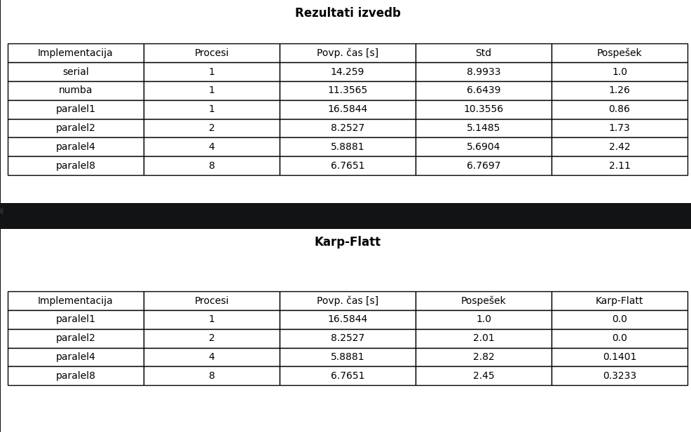

# WebScraper Projekt

Cilj projekta je preučiti učinkovitost različnih izvedb spletnega pajka, ki išče določeno ključna besedo na seznamu URL-jev. Problem spletnega pajkanja je v tem, da je aplikacija **delno CPU-bound** (obdelava vsebine strani, iskanje ključnih besed) in **delno I/O-bound** (čakanje na odzive strežnikov). To pomeni, da preprosta serijska izvedba pogosto ni optimalna, še posebej pri večjem številu URL-jev. Hkrati je pri paralelizaciji potrebno upoštevati tudi **omrežni overhead, komunikacijo med procesi in neenakomerno porazdelitev dela**.

Projekt vključuje tri implementacije spletnega pajka:

* **WebScraperSerial.py** – serijska izvedba (1 proces)
* **WebScraperParalel.py** – MPI izvedba z `mpi4py`, ki omogoča razdelitev dela med več procesov
* **WebSerialNumba.py** – serijska izvedba z Numba JIT optimizacijo, ki pospeši CPU-bound dele programa
* **urls.txt** – seznam URL-jev, na katerih se izvaja iskanje ključne besede (privzeta je `fakulteta`)

---

## Zagon programov

**Serijska verzija:**

```bash
python WebScraperSerial.py urls.txt fakulteta
```

**MPI verzija (z različnim številom jeder):**

```bash
mpiexec -n 4 python WebScraperParalel.py urls.txt fakulteta
```

**Numba serijska verzija:**

```bash
python WebSerialNumba.py urls.txt fakulteta
```

---

## Zahteve

Za vsako implementacijo je potrebno:

* Izvesti vsaj 10 ponovitev za zanesljivost meritev
* Izračunati povprečni čas, standardni odklon, minimalni in maksimalni čas
* Za MPI izvedbe preizkusiti različna števila procesov (1, 2, 4, 8)

S tem pristopom lahko ocenimo **pospešek** posamezne izvedbe in vpliv paralelizacije, pri čemer se upošteva tudi Karp-Flattova metrika za analizo učinkovitosti MPI.

---

## Pospešek in Karp-Flatt

* **Pospešek S(p):**

$$
S(p) = \frac{T_1}{T_p}
$$

kjer je \(T_1\) povprečni čas pri enem procesu, \(T_p\) pa povprečni čas pri p procesih.

* **Idealni linearni pospešek:**

$$
S_{\text{ideal}}(p) = p
$$

* **Karp-Flattova metrika:**

$$
e(p) = \frac{\frac{1}{S(p)} - \frac{1}{p}}{1 - \frac{1}{p}}
$$

* Manjši e(p) = boljša paralelizacija
* Večji e(p) = serijski del ali komunikacijski stroški

---

## 1. Povzetek testiranih izvedb

| Implementacija | Procesi | Povp. čas [s] | Std    | Pospešek |
| -------------- | ------- | ------------- | ------ | -------- |
| serial         | 1       | 4.5050        | 1.7372 | 1.00     |
| numba          | 1       | 2.4273        | 1.5843 | 1.85     |
| paralel1       | 1       | 2.3657        | 1.2073 | 1.90     |
| paralel2       | 2       | 1.8911        | 1.3428 | 2.38     |
| paralel4       | 4       | 1.4800        | 0.6804 | 3.04     |
| paralel8       | 8       | 2.8159        | 1.5229 | 1.60     |

Pospešek je izračunan glede na osnovno serijsko izvedbo. Vrednost 1 pomeni enako hitro izvajanje kot serijska verzija, vrednost večja od 1 pa pomeni hitrejše izvajanje.

[
$S = \frac{T_{serial}}{T_{izvedba}}$
]

**Interpretacija:**

* **Pospešek 1.85 (Numba)** pomeni, da je izvajanje Numba verzije skoraj dvakrat hitrejše od serijske izvedbe.
* **Paralel4 pospešek 3.04** pomeni, da paralelna izvedba s 4 jedri deluje 3× hitreje od serijske.
* **Paralel8 pospešek 1.60** je nižji kot pri paralel4, kar nakazuje, da več jeder ne pomeni vedno večjega pospeška zaradi overheada MPI komunikacije.

---

## 2. Primerjava posameznih ponovitev

* **X-os:** Ponovitev 1–10
* **Y-os:** Čas izvajanja [s]
* **Vsaka serija:** drugačna izvedba

Opazimo:

* **Serial**: največja razpršenost časov, od 2.35 s do 7.63 s
* **Numba**: nižji in bolj stabilni časi
* **Paralelni programi**: nižji časi, najbolj optimalni pri paralel4. Pri paralel8 se časi povečajo zaradi komunikacijskega overheada.

---

## 3. Povprečni časi

* **Najhitrejša izvedba:** paralel4 (1.48 s)
* **Serijska:** 4.505 s
* **Numba:** 2.427 s, skoraj polovico hitreje
* **Paralel8:** 2.815 s, višja kot paralel4, kar kaže na omejitve skaliranja

Če primerjamo povprečne čase vseh izvedb, je **najhitrejša izvedba paralel4** s povprečjem 1.48 s. Serijska izvedba je najpočasnejša (4.505 s), Numba zmanjša čas skoraj za polovico (2.427 s), medtem ko paralel8 (2.815 s) ne doseže optimala zaradi komunikacijskega overheada.

Pri paralel2 dobiš učinkovitost nad 1, kar lahko pomeni t. i. superlinearni pospešek, ampak pri spletnih zahtevah je bolj verjetno, da je to posledica nihanja omrežja, cache-a, razpoložljivosti strežnikov ali različnih odzivnih časov.


Pri 4 procesih je učinkovitost približno 0.76, kar pomeni, da se procesi še dokaj dobro izkoriščajo. Pri 8 procesih učinkovitost pade na približno 0.20, zato dodatni procesi ne prispevajo več sorazmerno k pospešku.

**Odstotek izboljšave časa:**

* Numba zmanjša povprečni čas izvajanja za približno 46 %.
* Največje izboljšanje doseže paralelna izvedba s 4 procesi, kjer se čas zmanjša za približno 67 %.
* Pri 8 procesih se izboljšava zmanjša na približno 38 %, kar kaže na slabše skaliranje pri večjem številu procesov.

---

## 4. Tabele rezultatov

**Celotne meritve:**



**Interpretacija Karp-Flatt:**

* **0.20 pri paralel2:** 20% serijski delež ali komunikacijski overhead
* **0.40 pri paralel4:** najbolj optimalno razmerje med paralelizacijo in overheadom
* **0.37 pri paralel8:** zmanjšana učinkovitost zaradi komunikacije, serijskega dela in neenakomerne razdelitve dela
Karp-Flattova metrika pri enem procesu ni definirana, zato je v tabeli označena z `-`.

Pomembno: pri Karp-Flatt velja, da je **manjša vrednost boljša**.

Torej:

* `paralel2`: Karp-Flatt = **0.20** → boljše skaliranje
* `paralel4`: Karp-Flatt = **0.40** → več overheada/serijskega vpliva kot pri 2 procesih
* `paralel8`: Karp-Flatt = **0.37** → še vedno precejšen overhead

Za `paralel1` Karp-Flatt **ni definiran**, ker formula vsebuje deljenje z:

$$
1 - \frac{1}{p}
$$

---

## 5. Analiza paralelnih izvedb


* **Povprečni čas ± standardni odklon**: zmanjšuje se do paralel4, nato raste pri paralel8
* **Praktični pospešek S(p)**: največji pri paralel4, pokazatelj optimalnega števila jeder
* **Idealni linearni pospešek**: linearno narašča, a praktični S(p) ne sledi idealu pri višjem številu jeder
* **Standardni odklon**: najnižji pri paralel4, kar kaže na stabilnost izvajanja

Čeprav bi pričakovali, da bo 8 procesov hitrejših od 4, se je v meritvah pokazalo nasprotno. Razlog je najverjetneje v komunikacijskem overheadu MPI, neenakomerni razdelitvi URL-jev med procese in predvsem v nestabilnosti HTTP zahtev. Spletni pajek ni samo CPU-bound problem, ampak je močno odvisen od omrežne latence in odzivnosti posameznih strežnikov.

---

## 6. Vpliv standardnega odklona
Standardni odklon je pri nekaterih izvedbah velik. To pomeni, da meritve niso zelo stabilne.

Na primer:

```text
serial std = 1.7372 s pri povprečju 4.5050 s
numba std = 1.5843 s pri povprečju 2.4273 s
paralel2 std = 1.3428 s pri povprečju 1.8911 s
```

Relativno velik standardni odklon kaže, da so meritve precej odvisne od zunanjih dejavnikov, predvsem od odzivnosti spletnih strani. Zato posamezna meritev ni dovolj zanesljiva, bolj smiselno je primerjati povprečja več ponovitev.


## 7. Zaključek

1. **Numba** skoraj dvakrat zmanjša serijski čas (S ≈ 1.85).
2. **Optimalni MPI pospešek** je pri 4 jedrih (S ≈ 3.04), pri 8 pa se učinkovitost zmanjša (S ≈ 1.60).
3. **Karp-Flattova metrika** jasno kaže, kje se začnejo komunikacijski stroški in serijski delež:
   * Majhno e(p) → dobra paralelizacija
   * Večje e(p) → omrežni latency, neenakomerna razdelitev, serijski del
4. **Praktičen nasvet:** več jeder ni vedno bolje; vedno preveri S(p) in e(p) za optimalno konfiguracijo.
5. **Varianca časov** pri serijski izvedbi je visoka, kar nakazuje vpliv latence spletnih strani.
6. **Za stabilnejše meritve** bi lahko uporabili več URL-jev (50–100).

